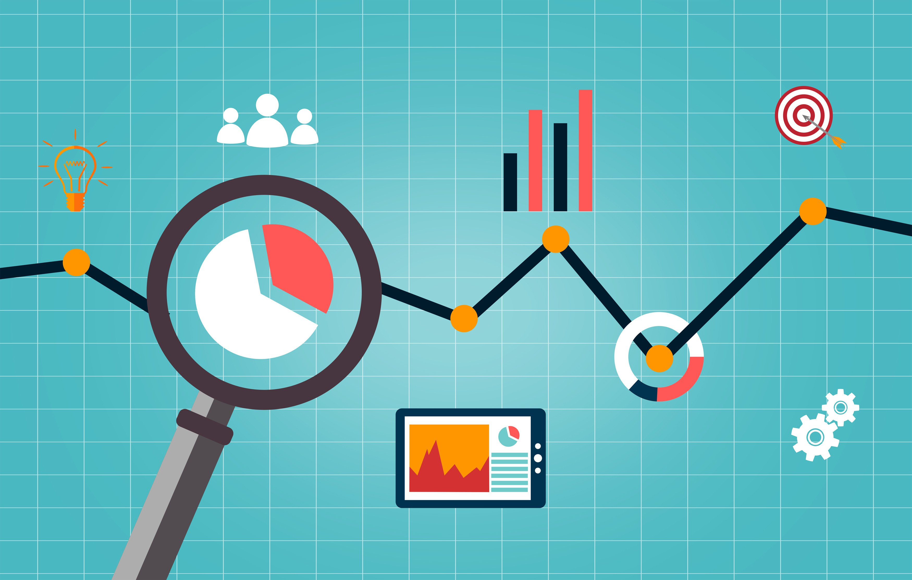

# Hi there 👋
## I'm Eliana, a data professional with more than 4 years of experience interacting with data analytics. 
### In this site you will see an overview of some of the projects I've worked on. You can aslo explore my LinkedIn Profile for more info about my professional background. 

<!--
**elianaburgos22/elianaburgos22** is a ✨ _special_ ✨ repository because its `README.md` (this file) appears on your GitHub profile.

Here are some ideas to get you started:

- 🔭 I’m currently working on ...
- 🌱 I’m currently learning ...
- 👯 I’m looking to collaborate on ...
- 🤔 I’m looking for help with ...
- 💬 Ask me about ...
- 📫 How to reach me: ...
- 😄 Pronouns: ...
- ⚡ Fun fact: ...
-->
